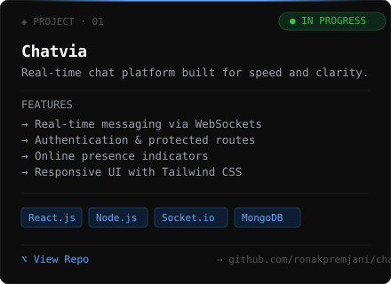
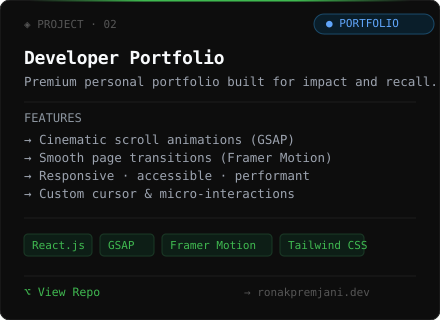

<!-- 
╔══════════════════════════════════════════════════════════════════════════════╗
║                                                                              ║
║   R O N A K   P R E M J A N I  ·  G I T H U B   P R O F I L E             ║
║                                                                              ║
║   Theme     RonakOS — Minimal Terminal Experience                            ║
║   Version   2.0.0                                                            ║
║   Palette   #0A0A0A · #F8FAFC · #8B949E · #60A5FA · #3FB950                ║
║   Font      SF Mono · Fira Code · JetBrains Mono                            ║
║                                                                              ║
╚══════════════════════════════════════════════════════════════════════════════╝
-->

<!-- ══════════════════════════════════════════════════════════════════════════
     §01  BOOT SEQUENCE  —  Animated terminal window, SSH + progress bar
     ══════════════════════════════════════════════════════════════════════════ -->

<div align="center">
  
</div>

<br/>

<!-- ══════════════════════════════════════════════════════════════════════════
     §02  ASCII IDENTITY  —  RONAK in block letters + animated subtitle
     ══════════════════════════════════════════════════════════════════════════ -->

<div align="center">

```
                                                                              
  ██████╗  ██████╗ ███╗   ██╗ █████╗ ██╗  ██╗
  ██╔══██╗██╔═══██╗████╗  ██║██╔══██╗██║ ██╔╝
  ██████╔╝██║   ██║██╔██╗ ██║███████║█████╔╝ 
  ██╔══██╗██║   ██║██║╚██╗██║██╔══██║██╔═██╗ 
  ██║  ██║╚██████╔╝██║ ╚████║██║  ██║██║  ██╗
  ╚═╝  ╚═╝ ╚═════╝ ╚═╝  ╚═══╝╚═╝  ╚═╝╚═╝  ╚═╝

  P · R · E · M · J · A · N · I                                                                        
```

</div>

<br/>

<div align="center">
  
</div>

<br/>

<div align="center">
  
  &nbsp;&nbsp;
  
  &nbsp;&nbsp;
  
</div>

<br/>

<div align="center">
  
</div>

<br/>

<!-- ══════════════════════════════════════════════════════════════════════════
     §03  WHOAMI  —  Identity card in terminal box
     ══════════════════════════════════════════════════════════════════════════ -->

### `$ whoami`

```
┌─────────────────────────────────────────────────────────────────────────────┐
│                                                                             │
│   Name          Ronak Premjani                                              │
│   Role          Full Stack Developer                                        │
│   Location      India                                                       │
│   Focus         Building production-ready web applications                  │
│                                                                             │
│   Currently     Chatvia — real-time chat platform  [ IN PROGRESS ]          │
│   Seeking       Internship  ·  Freelance  ·  Startup Opportunities          │
│                                                                             │
│   Status        Open to work  ●                                             │
│                                                                             │
└─────────────────────────────────────────────────────────────────────────────┘
```

<br/>

<!-- ══════════════════════════════════════════════════════════════════════════
     §04  MISSION  —  Mission statement + current objectives
     ══════════════════════════════════════════════════════════════════════════ -->

### `$ mission`

```
┌─────────────────────────────────────────────────────────────────────────────┐
│                                                                             │
│   MISSION STATEMENT                                                         │
│   ─────────────────                                                         │
│                                                                             │
│   Build software that solves real problems.                                 │
│   Ship fast. Iterate faster. Never stop learning.                           │
│                                                                             │
│   I don't just write code — I build products.                               │
│   Every line I commit is designed to be used, not just to exist.            │
│   Every project I ship has a purpose beyond the portfolio.                  │
│                                                                             │
├─────────────────────────────────────────────────────────────────────────────┤
│                                                                             │
│   CURRENT OBJECTIVES                                                        │
│   ──────────────────                                                        │
│                                                                             │
│   →  Ship Chatvia to production with real users                             │
│   →  Land a high-quality internship or freelance client                     │
│   →  Contribute meaningfully to open source                                 │
│   →  Master system design principles                                        │
│   →  Start architecting a SaaS product                                      │
│                                                                             │
└─────────────────────────────────────────────────────────────────────────────┘
```

<br/>

<!-- ══════════════════════════════════════════════════════════════════════════
     §05  PHILOSOPHY  —  Developer beliefs & principles
     ══════════════════════════════════════════════════════════════════════════ -->

### `$ philosophy`

```
┌─────────────────────────────────────────────────────────────────────────────┐
│                                                                             │
│   WHAT I BELIEVE                                                            │
│   ──────────────                                                            │
│                                                                             │
│   01   Write code that humans can read first, machines second.              │
│   02   Build for the user — not for the portfolio.                          │
│   03   Complexity is the enemy of execution.                                │
│   04   Good design is invisible. Bad design is unforgettable.               │
│   05   Ship it, then perfect it.                                            │
│   06   The best tool is the one you actually finish with.                   │
│   07   Consistency beats intensity. Show up every single day.               │
│                                                                             │
└─────────────────────────────────────────────────────────────────────────────┘
```

<br/>

<div align="center">
  
</div>

<br/>

<!-- ══════════════════════════════════════════════════════════════════════════
     §06  TECH STACK  —  Elegant code object
     ══════════════════════════════════════════════════════════════════════════ -->

### `$ tech`

```javascript
/**
 * RonakOS · System Configuration
 * ──────────────────────────────
 * Last updated: 2026
 */

const ronak = {

    frontend: [
        "React.js",           // Primary UI framework
        "JavaScript (ES6+)",  // Core language
        "Tailwind CSS",       // Utility-first styling
        "HTML5 & CSS3",       // Foundation
    ],

    backend: [
        "Node.js",            // Runtime environment
        "Express.js",         // Web framework
        "REST APIs",          // API architecture
    ],

    database: [
        "MongoDB",            // Primary database
    ],

    tooling: [
        "Git & GitHub",       // Version control
        "VS Code",            // Editor
        "Postman",            // API testing
        "Linux / Bash",       // Shell environment
    ],

    currentlyLearning: [
        "Next.js",            // Full-stack React framework
        "FastAPI",            // Python async API framework
        "Docker",             // Containerization
        "System Design",      // Architecture patterns
    ],

    contact: {
        linkedin:   "linkedin.com/in/ronakpremjani",
        github:     "github.com/ronakpremjani",
        email:      "ronak@example.com",
        portfolio:  "ronakpremjani.dev",
    },

};
```

<br/>

<div align="center">
  
</div>

<br/>

<!-- ══════════════════════════════════════════════════════════════════════════
     §07  FEATURED PROJECTS  —  Premium SVG project cards
     ══════════════════════════════════════════════════════════════════════════ -->

### `$ projects`

```
┌─────────────────────────────────────────────────────────────────────────────┐
│   FEATURED WORK  —  Production-grade applications                           │
└─────────────────────────────────────────────────────────────────────────────┘
```

<br/>

<div align="center">
  <table>
    <tr>
      <td width="50%" valign="top">
        
      </td>
      <td width="50%" valign="top">
        
      </td>
    </tr>
  </table>
</div>

<br/>

<div align="center">
  
</div>

<br/>

<!-- ══════════════════════════════════════════════════════════════════════════
     §08  ROADMAP  —  Terminal progress bars + 2026 objectives checklist
     ══════════════════════════════════════════════════════════════════════════ -->

### `$ roadmap`

```
┌─────────────────────────────────────────────────────────────────────────────┐
│                                                                             │
│   ACTIVE OPERATIONS  —  2026                                                │
│   ─────────────────────────                                                 │
│                                                                             │
│   Chatvia (v1.0)    ████████████████████░░░░░░   78%   In Progress         │
│   Internship        ████████████░░░░░░░░░░░░░░   48%   Searching           │
│   Freelance         ████████░░░░░░░░░░░░░░░░░░   32%   Building Base       │
│   Open Source       █████░░░░░░░░░░░░░░░░░░░░░   20%   Exploring           │
│   SaaS MVP          ██░░░░░░░░░░░░░░░░░░░░░░░░   10%   Ideation            │
│                                                                             │
├─────────────────────────────────────────────────────────────────────────────┤
│                                                                             │
│   2026 OBJECTIVES                                                           │
│   ───────────────                                                           │
│                                                                             │
│   [x]  Master React.js ecosystem                                            │
│   [x]  Build Chatvia (real-time chat application)                           │
│   [x]  Create a premium developer portfolio                                 │
│   [ ]  Land first internship at a quality company                           │
│   [ ]  Make first open source contribution                                  │
│   [ ]  Launch freelance services                                            │
│   [ ]  Deploy Chatvia to production with 100+ users                         │
│   [ ]  Start architecting a SaaS product                                    │
│   [ ]  Master Docker + system design principles                             │
│                                                                             │
└─────────────────────────────────────────────────────────────────────────────┘
```

<br/>

<div align="center">
  
</div>

<br/>

<!-- ══════════════════════════════════════════════════════════════════════════
     §09  GITHUB STATS  —  Professional stat layout
     ══════════════════════════════════════════════════════════════════════════ -->

### `$ github`

<br/>

<div align="center">
  
  &nbsp;&nbsp;
  
</div>

<br/>

<div align="center">
  
</div>

<br/>

<div align="center">
  
</div>

<br/>

<div align="center">
  <picture>
    <source
      media="(prefers-color-scheme: dark)"
      srcset="https://raw.githubusercontent.com/ronakpremjani/ronakpremjani/output/github-contribution-grid-snake-dark.svg"
    />
    
  </picture>
</div>

<br/>

<div align="center">
  
</div>

<br/>

<!-- ══════════════════════════════════════════════════════════════════════════
     §10  CONTACT  —  Links + handshake prompt
     ══════════════════════════════════════════════════════════════════════════ -->

### `$ contact`

```
┌─────────────────────────────────────────────────────────────────────────────┐
│                                                                             │
│   Let's build something great together.                                     │
│                                                                             │
│   I'm currently open to:                                                    │
│   →  Full-time internships  (remote or on-site)                             │
│   →  Freelance web development projects                                     │
│   →  Early-stage startup collaborations                                     │
│   →  Open source contributions                                              │
│                                                                             │
│   If you're building something interesting — reach out.                     │
│   I respond to every serious message.                                       │
│                                                                             │
└─────────────────────────────────────────────────────────────────────────────┘
```

<br/>

<div align="center">
  <a href="https://linkedin.com/in/ronakpremjani">
    
  </a>
  &nbsp;
  <a href="https://x.com/ronakpremjani">
    
  </a>
  &nbsp;
  <a href="mailto:ronak@example.com">
    
  </a>
  &nbsp;
  <a href="https://ronakpremjani.dev">
    
  </a>
</div>

<br/><br/>

<!-- ══════════════════════════════════════════════════════════════════════════
     §11  FOOTER  —  git commit + session close
     ══════════════════════════════════════════════════════════════════════════ -->

<div align="center">
  
</div>

<br/>

<!-- 
╔══════════════════════════════════════════════════════════════════════════════╗
║                                                                              ║
║   Connection closed.                                                         ║
║   Keep building.                                                             ║
║                                                                              ║
║   Crafted with intention by Ronak Premjani · RonakOS v2.0                   ║
║                                                                              ║
╚══════════════════════════════════════════════════════════════════════════════╝
-->
